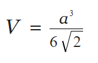
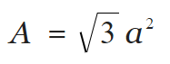
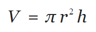
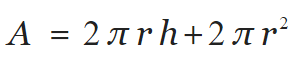
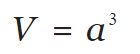
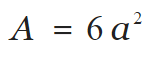
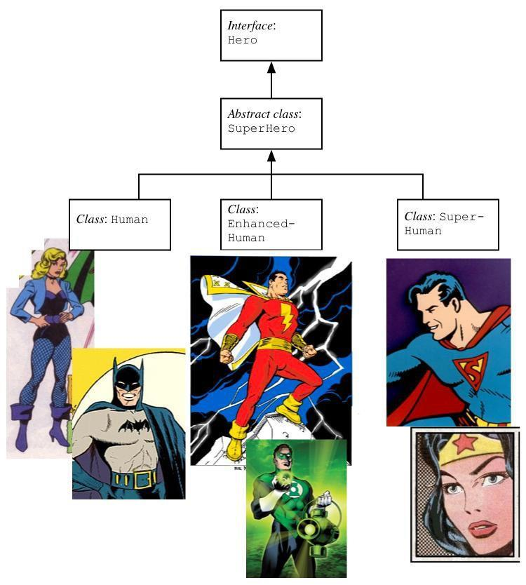

# Shapes

This exercise will give you experience in polymorphism.

You are provided with the `Shape` interface. Create three implementations of `Shape`, implementing the volume and surface area methods required by the interface as follows:

## `Tetrahedron(double edge)`






## `Cylinder(double radius, double height)` 






## `Cube(double edge)`






You can verify your classes work by constructing objects from them and checking that `volume` and `surfaceArea` return the correct results.

Your second task is to use polymorphism to complete the two methods in the `ShapeHandler` class:

```java
package shapes;

public class ShapeHandler {

    // Returns the sum of the volumes of the given shapes.
    public static double volumeSum(Shape[] shapes) {
        return 0;
    }

    // Returns the sum of the surface areas of the given shapes.
    public static double surfaceAreaSum(Shape[] shapes) {
        return 0;
    }

}
```

You can test that you have implemented `ShapeHandler` correctly by constructing an array of various shapes and passing them to your `ShapeHandler` methods.


**Question**:  Why do we make the Shape methods non-static but the ShapeHandler methods static?


# A superhero class hierarchy

This exercise will give you experience at interpreting Application Programming Interface documentation and developing non-trivial class hierarchies, including a Java _interface_, _abstract class_ and _concrete classes_.

Comic book superheroes remain in vogue thanks to the financial success of the recent Marvel movies. In this exercise you will develop a type hierarchy that models the characteristics of comic book superheroes. (But for testing purposes we will use 'Golden Age' superheroes from the 1940s and 1950s since these were when superheroes peaked.)

Enclosed with these instructions you will find the API documentation for a 'superhero' class hierarchy, along with two Java files:

* Enumerated type `SuperPower.java` which lists the superpowers available to
Golden Age superheroes.
*  A 'main' program `HeroTester.java` which will work fully only when you have completed the exercise. You will probably want to comment out some of the tests during code development. We suggest you begin with just the tests related to mortal superheroes uncommented. Once you have got this class working, uncomment some of the other tests.

Included in this documentation is the role of each class and the intended purpose of its members, as well as brief hints about intended usage.

Your task is to study the API documentation and, based on this, to implement the missing classes, `Hero.java`, `SuperHero.java`, `Human.java`, `EnhancedHuman.java` and `SuperHuman.java`. These classes form a hierarchy as shown overleaf. Make sure you read _all_ the API documentation and clearly understand how the various classes and their methods relate to one another _before_ you start writing code. Also, try to make good use of IntelliJ's "intention action" features to help you develop the code quickly. For instance, when creating a subclass you can get IntelliJ to automatically declare all the inherited methods that must be implemented. Remember that you can use Alt+Enter or click on the red or yellow light bulb to access intention actions.

**Hint**: For one of the above classes you will can implement the powers as an array. For another one of the classes you will need to need to implement the powers as a Set, implemented as a HashSet. The code to declare a HashSet is 
`HashSet<T> set=new HashSet<T>();`,
where  `T` is the name of the class stored in the Set. We will learn about Set/HashSet and other Java collections in week 4. You can find out more about the HashSet class, including with methods will be most useful, either via the Java API documentation or by using IntelliJ's inline help (hint: use Ctrl+Q to view the documentation for a method or class). Also, as powers are passed as an array you will need to find a way to convert them to a HashSet.




(**Comment for nitpickers**: The particular choices of superpowers used in test program `HeroTester.java` are somewhat debatable. For instance, Captain Marvel is usually described as 'swift as Mercury' but we have not given him the power of 'super speed' because he seems to be nowhere near as fast as characters who specialise in speed, such as The Flash. Similarly, we have not ascribed the power of flight to Wonder Woman because in her Golden Age incarnation she needed her invisible plane to fly. More recently, however, she has acquired the ability to 'ride the winds' as if flying. In summary, the superpowers used in `HeroTester.java` are for illustrative purposes only. No correspondence will be entered into.)

**Question**:  Why was Hero an declared as an interface? Why was SuperHero declared as an abstract Class. Could/Should we have declared Hero as an abstract class or SuperHero as an interface? Why or why not?


## Adding secret agents as heroes

So far the `Hero` interface doesn't appear to be especially helpful. However, it serves an important purpose because it gives us flexibility in extending the type hierarchy. For instance, we can add a (concrete) `SecretAgent` class below it, without affecting the superhero classes in any way.


Not only do secret agents have an alias (when on a mission James Bond is known as '007' and Maxwell Smart as 'Agent 86'), but they are frequently associated with gadgets (like Max's shoephone). Therefore, your `SecretAgent` class should inherit the features of the `Hero` class and add an attribute which stores the gadget typically associated with this agent (as a text string). Once again, consult the API documentation provided for the precise specification. Use the `AgentTester.java` program to test your class.

**Question:**  Do you need to declare a method for returning a secret agent powers? Why or why not?


# Exceptions

This exercise illustrates a use case for exceptions and gives you experience in raising and handling exceptions.

The below `BankAccount` class has been implemented correctly but it requires some exception handling.

Copy and paste the code into new `BankAccount.java` file under the `bank` package.

```java
package bank;

public class BankAccount {

    private int funds;

    /**
     * Deposits an amount into this bank account.
     *
     * @param amount
     */
    public void deposit(int amount) {
        this.funds += amount;
    }

    /**
     * Getter method for funds.
     *
     * @return current funds.
     */
    public int getFunds() {
        return this.funds;
    }

    /**
     * Withdraws an amount from this bank account.
     *
     * @param amount
     * @throws FundsException if there are insufficient funds for the withdraw.
     */
    public void withdraw(int amount) {
        System.out.printf("Attempting withdraw... ");
        this.funds -= amount;
        System.out.printf("Withdrew %d funds.\n", amount);
    }

    /**
     * Transfers an amount from one bank account to another.
     *
     * @param b1 The bank account the funds are transferred from.
     * @param b2 The bank account the funds are transferred to.
     * @param amount The amount to be transferred.
     * @throws TransferException if the withdraw fails.
     */
    public static void transfer(BankAccount b1, BankAccount b2, int amount) {
        System.out.printf("Attempting transfer... ");
        b1.withdraw(amount);
        b2.deposit(amount);
        System.out.printf("Transferred %d funds from b1 to b2. Account b1 has %d funds. Account b2 has %d funds.\n", amount, b1.getFunds(), b2.getFunds());
    }


}
```

Add some exception handling to this class:

- In the withdraw method first check if there are sufficient funds to be withdrawn (the account is not allowed to overdraft). If there are insufficient funds then throw a `FundsException` with the message: `String.format("Withdraw failed. This account has %d in funds but %d were requested.", this.funds, amount)`.
- In the transfer method handle the possibility of a `FundsException` thrown by the `withdraw` call. If a `FundsException` is caught (with identifier `e`) then simply throw a `TransferException` with the message: `String.format("Transfer failed due to underlying exception: %s", e.getMessage())`.
- In the transfer method add a `finally` block after your `catch`. Normally in `finally` blocks we include cleanup code. Represent some 'cleanup code' by just including one line in your `finally` block: `System.out.printf("Cleanup transfer.\n");`.     


Now try running `BankTester` and observe what happens. Try following the control flow using the debugger. The expected terminal output is shown below.


Notice that control flow is **always** passed to the `finally` block before the method exits. This is particularly interesting in the last case where the `NullPointerException` is unhandled by the transfer method yet the `finally` block is executed prior to the exception propagation.

```
Test 1: No exceptions.
Attempting transfer... Attempting withdraw... Withdrew 25 funds.
Transferred 25 funds from b1 to b2. Account b1 has 75 funds. Account b2 has 25 funds.
Cleanup transfer.

Test 2: Exception thrown by withdraw.
Attempting withdraw... Withdraw threw an exception. Exception is of class 'class bank.FundsException' with message 'Withdraw failed. This account has 75 in funds but 200 were requested.'

Test 3: Transfer handles exception propagation from withdraw.
Attempting transfer... Attempting withdraw... Cleanup transfer.
Transfer threw an exception. Exception is of class 'class bank.TransferException' with message 'Transfer failed due to underlying exception: Withdraw failed. This account has 75 in funds but 200 were requested.'

Test 4: Main does not handle an exception propagated by Transfer.
Attempting transfer... Cleanup transfer.
Exception in thread "main" java.lang.NullPointerException
	at bank.BankAccount.transfer(BankAccount.java:51)
	at bank.BankTester.main(BankTester.java:31)

Process finished with exit code 1
```
